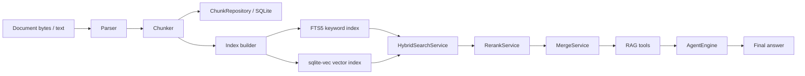

# Tiny RAG

[中文](README.zh-CN.md) | English


Tiny RAG is a compact RAG and Agent application skeleton for local experiments.
It covers document conversion, structure-aware chunking, SQLite persistence,
keyword/vector indexing, hybrid retrieval, reranking, context merge, and an
OpenAI-compatible function-calling Agent loop.

The goal is not to hide the retrieval stack behind a black box. Tiny RAG keeps
each stage small enough to inspect, test, and replace.

## Demo

Live run with the local `.env` API configuration:


Offline deterministic run, no API key required:


Both demos exercise the same application path:

```text
document
  -> parser
  -> chunker
  -> SQLite chunk store
  -> FTS5 keyword index + sqlite-vec vector index
  -> hybrid retrieval + rerank + merge
  -> Agent tool registry
  -> knowledge_search tool call
  -> final answer
```

## Quickstart

Run the offline demo:

```bash
uv run python scripts/demo_agent_app.py
```

Run with a real OpenAI-compatible chat model:

```bash
set -a
source .env
set +a
uv run python scripts/demo_agent_app.py --live
```

Use a local Markdown/text document:

```bash
uv run python scripts/demo_agent_app.py \
  --document tests/fixtures/documents/markdown/sample_manual.md \
  --query "What options does the manual describe for chunking?"
```

The live mode only uses the LLM for the Agent decision and final answer. The demo
keeps deterministic local embedding/reranking so retrieval is reproducible.

## What It Shows

- End-to-end RAG application flow from ingest to Agent answer.
- Structure-aware chunking with offsets, diagnostics, heading/heuristic routing,
  table handling, protected spans, and parent-child support.
- SQLite persistence for chunks plus FTS5 keyword retrieval and `sqlite-vec`
  vector retrieval.
- Hybrid retrieval, score normalization, deduplication, rerank, and context merge.
- OpenAI-compatible chat adapter, tool registry, tool-call execution, retry,
  timeout, cancellation, context compression, and final-answer fallback.
- A TypeScript terminal Agent shell with streaming, thinking/answer separation,
  local history, and prompt verification.

## Architecture



## Python Entry Points

- `tiny_rag.chunking.split_with_diagnostics`: split normalized text into chunks
  with strategy diagnostics.
- `tiny_rag.persistence.persist_text_chunks`: persist chunks while preserving
  context headers for indexing.
- `tiny_rag.indexing.index_knowledge_after_chunks_persisted`: build keyword and
  vector index records from persisted chunks.
- `tiny_rag.indexing.repositories.sqlite.SQLiteIndexRepository`: SQLite-backed
  keyword retrieval through FTS5 and vector retrieval through `sqlite-vec`.
- `tiny_rag.service.IngestService`: parse, chunk, persist, and index a document.
- `tiny_rag.service.AgentService`: assemble hybrid retrieval, rerank/merge, and
  RAG tools.
- `tiny_rag.service.SessionService`: run scoped knowledge QA or Agent QA.

Minimal keyword-only flow:

```python
from tiny_rag.chunking import SplitterConfig
from tiny_rag.indexing import index_knowledge_after_chunks_persisted
from tiny_rag.indexing.models import RetrieveParams
from tiny_rag.indexing.repositories.sqlite import SQLiteIndexRepository
from tiny_rag.persistence import connect, persist_text_chunks

conn = connect(":memory:")
persisted = persist_text_chunks(
    conn,
    tenant_id=1,
    knowledge_id="knowledge-1",
    knowledge_base_id="kb-1",
    text="# Runbook\n\nThe latency_budget is 120ms.",
    config=SplitterConfig(strategy="auto"),
)

repository = SQLiteIndexRepository(conn)
index_knowledge_after_chunks_persisted(
    conn=conn,
    repository=repository,
    knowledge_id="knowledge-1",
    title="Runbook",
    chunks=persisted.inserted_chunks,
    retriever_types=["keywords"],
)

results = repository.retrieve(
    RetrieveParams(query="latency_budget", knowledge_ids=["knowledge-1"], top_k=3)
)
```

## Configuration

For live chat model calls:

```text
LLM_API_KEY=...
LLM_BASE_URL=https://api.openai.com/v1
LLM_MODEL_NAME=gpt-4.1-mini
```

For vector indexing with an OpenAI-compatible embedding service:

```text
EMBEDDING_API_KEY=...
EMBEDDING_BASE_URL=https://api.openai.com/v1
EMBEDDING_MODEL_NAME=text-embedding-3-small
EMBEDDING_DIMENSIONS=1536
```

For reranking:

```text
RERANK_API_KEY=...
RERANK_BASE_URL=https://api.siliconflow.cn/v1
RERANK_MODEL_NAME=BAAI/bge-reranker-v2-m3
```

## Tests

Use the project test runner through `uv`:

```bash
uv run python scripts/run_tests.py unit
uv run python scripts/run_tests.py integration
uv run python scripts/run_tests.py full
```

The unit lane covers chunking, persistence, embedding behavior, retrieval,
Agent tools, service assembly, and SQLite indexing/retrieval. The integration
lane exercises parser smoke tests and an in-memory ingest plus Agent/RAG tool
flow.

Optional parser dependencies:

```bash
uv sync --group integration
```

## Agent TUI

The TypeScript TUI lives in `agent-tui/`:

```bash
cd agent-tui
npm install
npm run verify:prompts
npm start
```

It supports streaming responses, thinking/answer separation, persisted local
history, and generic function-calling execution. The Python service already
registers the RAG tools; wiring those tools into the TUI is the next UI
integration step.

## Project Layout

```text
tiny_rag/
  agent/        # Agent loop, messages, tool execution, tool registry
  chunking/     # splitters, diagnostics, protected spans, parent-child chunks
  converting/   # Markdown/PDF/DOCX parsing adapters
  embedding/    # OpenAI-compatible embeddings and batch helpers
  indexing/     # index orchestration and SQLite repository
  persistence/  # chunk schema, repository, persist service
  retrieval/    # hybrid search, rerank, merge
  service/      # ingest/query/agent session services
agent-tui/      # TypeScript terminal Agent shell
scripts/        # demos, test runner, chunking preview
tests/          # unit and integration coverage
```

## Current Scope

Tiny RAG is intentionally small and local-first. It is a good fit for studying
or demonstrating Agent application engineering, RAG internals, and service
assembly. It is not yet packaged as a full production server with auth, CI,
Docker deployment, persistent multi-tenant storage, or a polished web UI.
