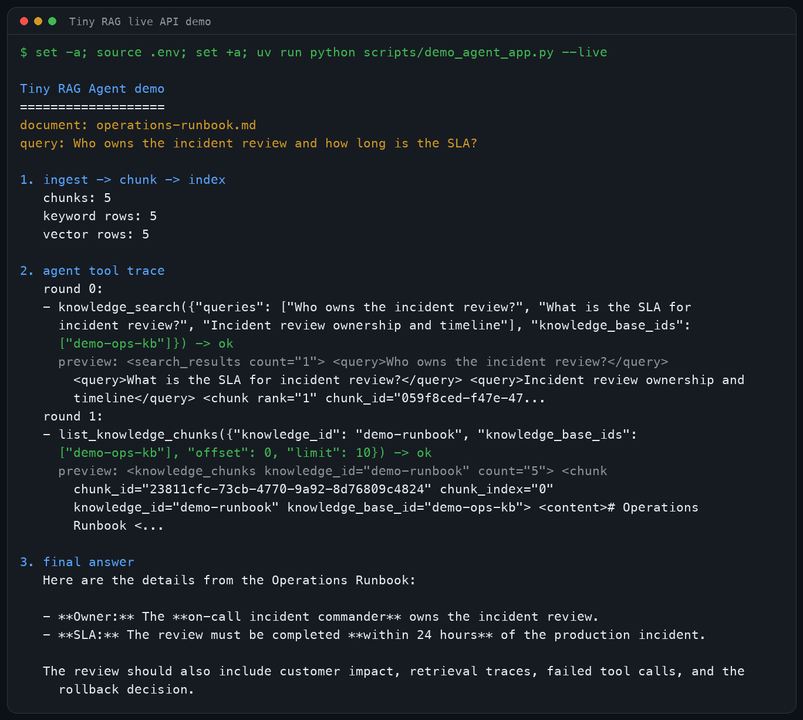
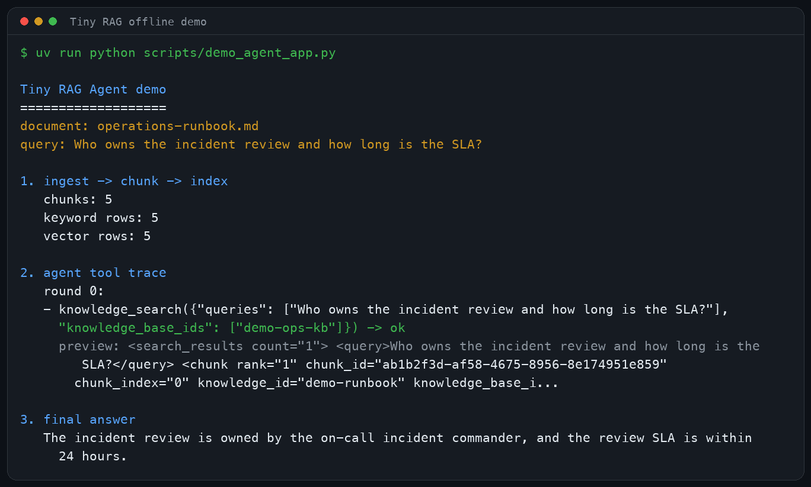
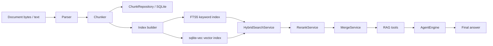

# Tiny RAG

中文 | [English](README.md)


Tiny RAG 是一个本地优先的 RAG + Agent 应用骨架。它覆盖文档解析、结构化
chunking、SQLite 持久化、关键词/向量索引、混合检索、rerank、上下文合并，
以及兼容 OpenAI 协议的 function-calling Agent 循环。

这个项目的重点不是把检索链路藏进黑盒，而是把每个阶段拆小：能读、能测、
能替换，也方便在面试或技术分享里讲清楚 Agent 应用的工程边界。

## 演示截图

使用本地 `.env` 里已经配置好的 API 跑 live 模式：



离线确定性 demo，不需要 API key：



两种 demo 走的是同一条应用链路：

```text
文档
  -> 解析
  -> 分块
  -> SQLite chunk 存储
  -> FTS5 关键词索引 + sqlite-vec 向量索引
  -> hybrid retrieval + rerank + merge
  -> Agent tool registry
  -> knowledge_search 工具调用
  -> 最终回答
```

## 快速开始

运行离线 demo：

```bash
uv run python scripts/demo_agent_app.py
```

使用真实 OpenAI-compatible chat model：

```bash
set -a
source .env
set +a
uv run python scripts/demo_agent_app.py --live
```

换成本地 Markdown/text 文档：

```bash
uv run python scripts/demo_agent_app.py \
  --document tests/fixtures/documents/markdown/sample_manual.md \
  --query "What options does the manual describe for chunking?"
```

live 模式只把 LLM 用在 Agent 决策和最终回答阶段。demo 里的 embedding 和
rerank 仍然是确定性的本地实现，所以检索结果可以稳定复现。

## 它展示了什么

- 从文档入库到 Agent 回答的端到端 RAG 应用闭环。
- 结构感知 chunking：offset、diagnostics、heading/heuristic 路由、表格处理、
  protected spans、parent-child chunk。
- 基于 SQLite 的 chunk 持久化、FTS5 关键词检索和 `sqlite-vec` 向量检索。
- hybrid retrieval、分数归一化、去重、rerank、上下文合并。
- OpenAI-compatible chat adapter、tool registry、工具调用执行、重试、超时、
  取消、上下文压缩、检索历史脱敏、最终答案兜底合成。
- TypeScript 终端 Agent 壳：流式输出、thinking/answer 分离、本地历史、
  prompt 校验和通用 function-calling plumbing。

## 架构



## Python 入口

- `tiny_rag.chunking.split_with_diagnostics`：按策略切分文本并返回诊断信息。
- `tiny_rag.persistence.persist_text_chunks`：持久化 chunk，同时保留用于索引的
  context header。
- `tiny_rag.indexing.index_knowledge_after_chunks_persisted`：基于已持久化 chunk
  构建关键词和向量索引记录。
- `tiny_rag.indexing.repositories.sqlite.SQLiteIndexRepository`：基于 FTS5 和
  `sqlite-vec` 的 SQLite 检索仓储。
- `tiny_rag.service.IngestService`：解析、切分、持久化并索引文档。
- `tiny_rag.service.AgentService`：装配 hybrid retrieval、rerank/merge 和 RAG
  tools。
- `tiny_rag.service.SessionService`：在指定知识库范围内执行 knowledge QA 或
  Agent QA。

最小关键词检索流程：

```python
from tiny_rag.chunking import SplitterConfig
from tiny_rag.indexing import index_knowledge_after_chunks_persisted
from tiny_rag.indexing.models import RetrieveParams
from tiny_rag.indexing.repositories.sqlite import SQLiteIndexRepository
from tiny_rag.persistence import connect, persist_text_chunks

conn = connect(":memory:")
persisted = persist_text_chunks(
    conn,
    tenant_id=1,
    knowledge_id="knowledge-1",
    knowledge_base_id="kb-1",
    text="# Runbook\n\nThe latency_budget is 120ms.",
    config=SplitterConfig(strategy="auto"),
)

repository = SQLiteIndexRepository(conn)
index_knowledge_after_chunks_persisted(
    conn=conn,
    repository=repository,
    knowledge_id="knowledge-1",
    title="Runbook",
    chunks=persisted.inserted_chunks,
    retriever_types=["keywords"],
)

results = repository.retrieve(
    RetrieveParams(query="latency_budget", knowledge_ids=["knowledge-1"], top_k=3)
)
```

## 配置

真实 chat model 调用：

```text
LLM_API_KEY=...
LLM_BASE_URL=https://api.openai.com/v1
LLM_MODEL_NAME=gpt-4.1-mini
```

使用 OpenAI-compatible embedding 服务做向量索引：

```text
EMBEDDING_API_KEY=...
EMBEDDING_BASE_URL=https://api.openai.com/v1
EMBEDDING_MODEL_NAME=text-embedding-3-small
EMBEDDING_DIMENSIONS=1536
```

使用 rerank 服务：

```text
RERANK_API_KEY=...
RERANK_BASE_URL=https://api.siliconflow.cn/v1
RERANK_MODEL_NAME=BAAI/bge-reranker-v2-m3
```

## 测试

通过 `uv` 运行测试：

```bash
uv run python scripts/run_tests.py unit
uv run python scripts/run_tests.py integration
uv run python scripts/run_tests.py full
```

unit lane 覆盖 chunking、persistence、embedding、retrieval、Agent tools、服务装配
和 SQLite indexing/retrieval。integration lane 覆盖 parser smoke tests，以及
内存中的 ingest + Agent/RAG tool 链路。

可选 parser 依赖：

```bash
uv sync --group integration
```

## Agent TUI

TypeScript TUI 位于 `agent-tui/`：

```bash
cd agent-tui
npm install
npm run verify:prompts
npm start
```

它支持流式响应、thinking/answer 分离、本地历史和通用 function-calling 执行。
默认启动时会索引内置本地 KB，并在 TypeScript Agent loop 内注册
面向用户问答的完整工具 `knowledge_search`。传入一个或多个 `--rag-document`
参数可以用自己的本地文件替换默认 KB；传 `--no-rag` 则进入纯聊天模式。

## 项目结构

```text
tiny_rag/
  agent/        # Agent loop、messages、工具执行、tool registry
  chunking/     # splitters、diagnostics、protected spans、parent-child chunks
  converting/   # Markdown/PDF/DOCX parser adapters
  embedding/    # OpenAI-compatible embeddings 和 batch helpers
  indexing/     # index orchestration 和 SQLite repository
  persistence/  # chunk schema、repository、persist service
  retrieval/    # hybrid search、rerank、merge
  service/      # ingest/query/agent session services
agent-tui/      # TypeScript terminal Agent shell
scripts/        # demos、test runner、chunking preview
tests/          # unit 和 integration 测试
```

## 当前边界

Tiny RAG 目前是小而完整的本地工程骨架，适合学习、演示和讨论 Agent 应用工程、
RAG 内部链路、服务装配与测试设计。它还不是一个完整生产服务：暂未包含 auth、
CI、Docker 部署、持久多租户服务化存储或正式 Web UI。
